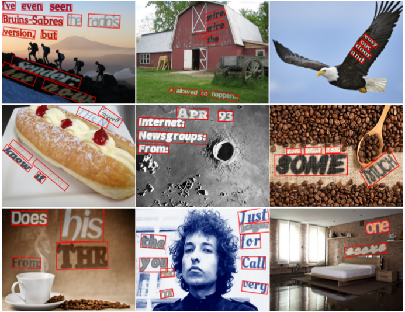

# SynthText

Проект генерирует синтетические изображения с текстом на реальных сценах по идее из статьи
["Synthetic Data for Text Localisation in Natural Images", Ankush Gupta, Andrea Vedaldi, Andrew Zisserman, CVPR 2016](http://www.robots.ox.ac.uk/~vgg/data/scenetext/).

Текущая версия проекта переведена на Python 3, разложена по пакету `synthtext/` и содержит CLI, простой GUI, диагностику RANSAC/placement и режим визуализации.



## Что Нужно Для Работы

Основные зависимости:

```text
pygame, opencv-python, pillow, numpy, matplotlib, h5py, scipy
```

Если используется локальное виртуальное окружение:

```bash
python3 -m venv .venv
.venv/bin/pip install -r requirements.txt
```

Входные данные должны лежать в `.h5`-файлах и содержать изображения, depth map и segmentation. По умолчанию приложение ищет файлы в папке `input/`.

## Быстрый Запуск

Запуск через командную строку:

```bash
.venv/bin/python gen.py --input-dir input --num-img 10
```

Запуск с визуализацией:

```bash
.venv/bin/python gen.py --input-dir input --num-img 10 --viz
```

Запуск GUI:

```bash
.venv/bin/python gui.py
```

Результат по умолчанию сохраняется в:

- `results/SynthText.h5` - основной HDF5 с изображениями, `charBB`, `wordBB`, `txt`, `lang`.
- `results_png/` - папка для PNG-вывода, если он используется в пайплайне.

## GUI

GUI находится в `synthtext/gui.py`, а запускать его удобнее через корневой файл:

```bash
.venv/bin/python gui.py
```

Окно GUI позволяет:

- выбрать входную папку с `.h5`;
- указать fallback `.h5`;
- выбрать папку `data/` с моделями, шрифтами и текстовыми источниками;
- задать выходной HDF5 и папку PNG;
- настроить количество изображений, попытки, таймауты и число workers;
- включить `--viz`, `--ransac-debug`, `--placement-debug`, `--debug-progress`;
- запустить/остановить генерацию;
- смотреть live-лог процесса;
- в режиме `--viz` переходить к следующему изображению кнопкой `Continue viz` или завершать просмотр через `Quit viz`.

GUI не содержит отдельной логики генерации: он собирает и запускает обычную команду `gen.py` с выбранными флагами. Это удобно, потому что CLI и GUI проверяют один и тот же пайплайн.

## Основные Флаги CLI

Полный список можно посмотреть так:

```bash
.venv/bin/python gen.py --help
```

| Флаг | По умолчанию | Описание |
| --- | --- | --- |
| `--input-dir PATH` | `input` | Папка с входными `.h5`-файлами. |
| `--fallback-h5 PATH` | `street/bg_data/bg_data.h5` | Резервный `.h5`, если во входной папке ничего не найдено. |
| `--render-data-path PATH` | `data` | Папка с моделями, шрифтами и текстовыми источниками. |
| `--output-file PATH` | `results/SynthText.h5` | Базовый путь выходного HDF5. |
| `--png-dir PATH` | `results_png` | Папка для PNG-вывода. |
| `--num-img N` | `-1` | Сколько изображений брать из каждого входного файла. `-1` означает все. |
| `--instances-per-image N` | `1` | Сколько текстовых инстансов пытаться разместить на одном изображении. |
| `--secs-per-img N` | `5` | Лимит времени на рендер одного изображения. |
| `--max-global-tries N` | `8` | Максимальное число повторных попыток для изображения. |
| `--max-h5-size-gb N` | `10.0` | Максимальный размер одного выходного HDF5 перед переключением на следующий файл. |
| `--region-workers N` | `1` | Число потоков для независимого RANSAC/plane fitting по candidate-регионам. `1` сохраняет последовательный режим. |
| `--viz` | выключен | Показывает визуализацию во время генерации. |
| `--interactive` | выключен | При запуске спрашивает путь к входной папке. |
| `--ransac-debug` | выключен | Печатает подробную диагностику RANSAC. |
| `--ransac-stats N` | `0` | Отдельный режим статистики по первым `N` изображениям. Не рендерит текст и не пишет выходной HDF5. |
| `--placement-debug` | выключен | Печатает причины отказов на этапе placement/overlay. |
| `--debug-progress` | выключен | Печатает прогресс по файлам, изображениям и попыткам. Автоматически включается для `--ransac-stats`, `--ransac-debug`, `--placement-debug`. |

## Примеры Запуска

Сгенерировать 100 изображений:

```bash
.venv/bin/python gen.py --input-dir input --num-img 100
```

Запустить с визуализацией и ручным переходом между примерами:

```bash
.venv/bin/python gen.py --input-dir input --num-img 20 --viz
```

Ускорить проверку независимых регионов:

```bash
.venv/bin/python gen.py --input-dir input --num-img 100 --region-workers 4
```

Собрать статистику отказов RANSAC/placement на 1000 изображениях:

```bash
.venv/bin/python gen.py --input-dir input --ransac-stats 1000
```

Включить подробный debug:

```bash
.venv/bin/python gen.py --input-dir input --num-img 20 --ransac-debug --placement-debug
```

## Режим RANSAC-Статистики

Флаг `--ransac-stats N` запускает отдельный диагностический режим. Он проходит первые `N` изображений, проверяет регионы, depth, RANSAC и placement-mask, после чего печатает сводку:

- сколько изображений прошло успешно;
- сколько было отказов из-за отсутствия raw/shape/depth/placement регионов;
- какие события чаще всего встречались в region filtering;
- какие события чаще всего встречались в placement;
- список худших изображений для ручного анализа.

Этот режим не создаёт renderer, не накладывает текст и не записывает `results/SynthText.h5`.

## Визуализация

При `--viz` приложение показывает промежуточные и финальные изображения. После каждого изображения процесс ждёт ввода:

- `Enter` - перейти к следующему изображению;
- `q` - остановить визуализацию.

В GUI для этого есть кнопки:

- `Continue viz`;
- `Quit viz`.

Для просмотра уже сохранённого HDF5:

```bash
.venv/bin/python -m synthtext.tools.visualize_results
```

## Структура Проекта

Основная реализация находится внутри `synthtext/`:

```text
synthtext/
  cli.py              # CLI-флаги и запуск пайплайна
  config.py           # GenerationConfig
  pipeline.py         # основной цикл генерации
  h5_io.py            # чтение входных H5 и запись результата
  gui.py              # Tkinter GUI
  debug_viz.py        # функции визуализации
  ransac_stats.py     # диагностический режим RANSAC/placement
  rendering/
    renderer.py       # RendererV3
    overlay.py        # overlay/compositing helper-методы
    text_service.py   # явный мост renderer -> text_utils
    text_utils.py     # шрифты, текстовые источники, bitmap masks
    colorize.py       # цвет, shadow, border, blending
    poisson.py        # poisson blending helpers
  spatial/
    regions.py        # поиск и фильтрация областей
    geometry.py       # homography/geometry helpers
    ransac.py         # fit_plane_ransac
    synth_utils.py    # depth/camera/plane utilities
  augmentation/
    noise.py          # шумы и деградации изображения
    extra.py          # дополнительные аугментации
    transforms.py     # базовые transform helpers
  tools/
    visualize_results.py
    invert_font_size.py
```

В корне оставлены только пользовательские точки запуска `gen.py` и `gui.py`. Старые compatibility wrappers вроде `synthgen.py`, `text_utils.py`, `ransac.py` удалены. Для импортов используйте новые пути, например:

```python
from synthtext.rendering.renderer import RendererV3
from synthtext.rendering.text_utils import RenderFont
from synthtext.spatial.regions import TextRegions
from synthtext.spatial.ransac import fit_plane_ransac
from synthtext.rendering.colorize import Colorize
```

## Данные

Папка `data/` обычно содержит:

- `data/fonts` - шрифты и `fontlist.txt`;
- `data/newsgroup` - текстовые источники;
- `data/models/colors_new.cp` - модель цветов текста;
- `data/models/char_freq.cp` - частоты символов;
- `data/models/font_px2pt.cp` - соответствие высоты шрифта в px и pt.

Входные `.h5` должны содержать совместимые группы изображений, depth и segmentation. Пайплайн автоматически пытается найти группы с типичными именами вроде `img`, `depth`, `seg`.

## Дополнительная Информация

Оригинальный предобработанный набор фонов SynthText описан на странице проекта VGG:

`http://www.robots.ox.ac.uk/~vgg/data/scenetext/preproc/<filename>`

Для подробной навигации по классам и методам см. `CODE_REFERENCE.md`.
